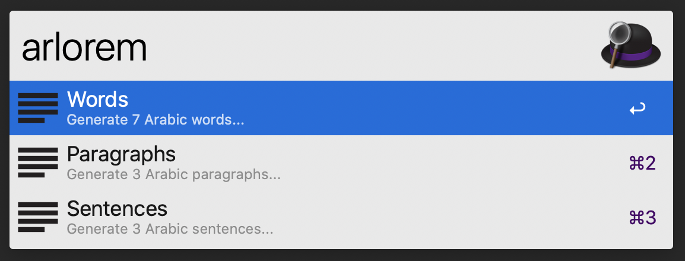

# Lorem Ipsum Arabic Workflow for Alfred

An ultra-fast Lorem Ipsum Arabic workflow for Alfred 3.



## Installation

1. [Download the latest version](https://github.com/PatelUtkarsh/alfred-lorem-ipsum-arabic/releases/download/v0.1.0/Lorem.Ipsum.alfredworkflow)
2. Install the workflow by double-clicking the `.alfredworkflow` file
3. You can add the workflow to a category, then click "Import" to finish importing. You'll now see the workflow listed in the left sidebar of your Workflows preferences pane.

## Usage

```
arlorem words <number>
arlorem sentences <number>
arlorem paragraphs <number>
```

Just type `arlorem` followed by either `words`, `sentences` or `paragraphs` and optionally a number.

Instead of typing you may of course use Alfred's hotkeys to navigate faster.

## Props
- https://github.com/tillkruss/alfred-lorem-ipsum
- https://github.com/joetannenbaum/alfred-workflow
- https://github.com/joshtronic/php-loremipsum